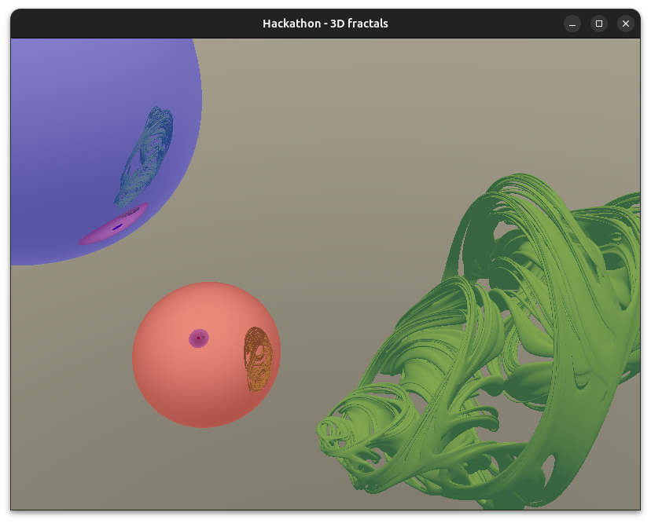
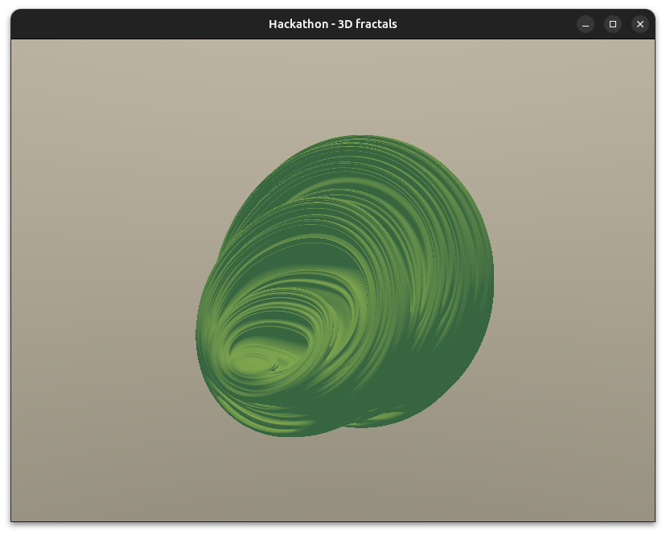
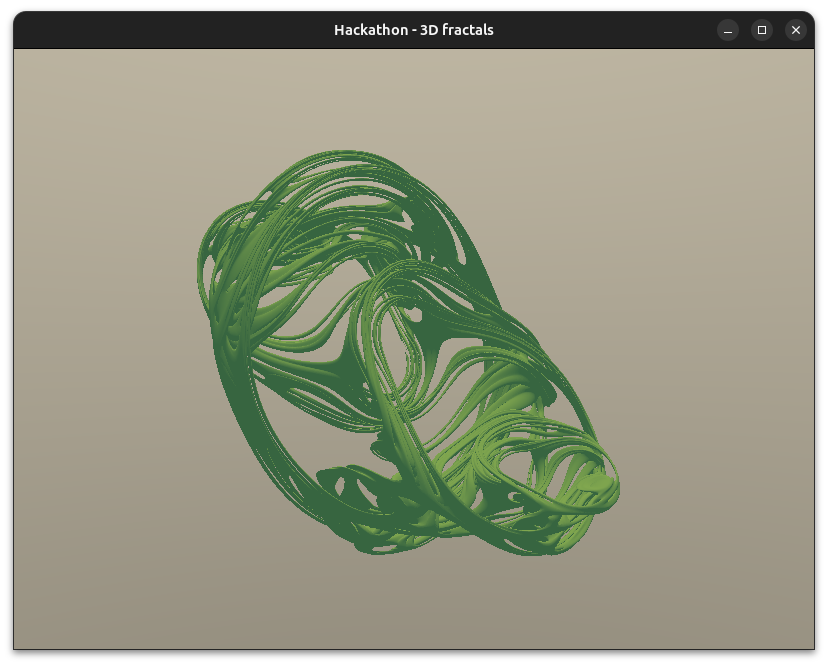

_Ce projet est réalisé dans le cadre de la semaine Hackathon aux Mines, du 30 juin au 4 juilet._

# Moteur de rendu pour fractales 3D par ray-tracing et accélération

Le projet consiste à développer un programme C, utilisant la carte graphique (via OpenGL), pour visualiser des fractales 3D du type "Julia set" ou "Mandelbulb". Ces fractales sont déterministes et définies par convergence ou non, pour chaque point de l'espace, de la suite itérée d'une certaine fonction en ce point. Les méthodes de ray-tracing habituelles sont difficilement applicables ici car on ne connaît pas les "primitives" de la fractale, autrement dit on ne sait pas calculer l'intersection entre un certain rayon et la fractale.
Les références 1 à 3 font état de méthodes itératives pour estimer la distance entre un volume et la fractale.
La référence 4 est utile en général pour le ray-tracing.

### Objectif et livrable
Un exécutable permettant de visualiser des fractales au choix, de se déplacer dans l'espace et de zoomer, si possible en temps réel.

### Références
[1] Ray Tracing Deterministic 3-D Fractals
https://dl.acm.org/doi/pdf/10.1145/74333.74363 

[2] New techniques for ray tracing procedurally defined objects
https://dl.acm.org/doi/pdf/10.1145/964967.801137 

[3] Bounding ellipsoids for ray-fractal intersection
https://dl.acm.org/doi/pdf/10.1145/325165.325176 

[4] RAY TRACING GEMS II
https://link.springer.com/content/pdf/10.1007/978-1-4842-7185-8.pdf

[5] The Science of Fractal Images
https://link.springer.com/book/10.1007/978-1-4612-3784-6

# Feuille de route

1. Documentation
    - [x] lecture et compréhension des logiques de ray-tracing pour les fractales

2. Ray-tracing basique
    - [x] ouverture d'une fenêtre, importation des librairies
        - choix de librairies : GLFW + CUDA pour le calcul GPU
        - https://cuda-tutorial.readthedocs.io/en/latest/tutorials/tutorial01/
        - https://developer.nvidia.com/blog/accelerated-ray-tracing-cuda/
    - [x] affichage d'une sphère
    - [x] éclairage et ombres
    - [x] déplacement dans l'espace

3. Fractales
    - [x] méthode des _unbounding volumes_
    - [x] éclairage et ombres
    - [ ] colorisation : _rendering_ et _clarity_
    - [x] réflection

### Journal de bord
- **Lundi 30 juin** - Après lecture du document 1, j'ai établi ma feuille de route. Ayant déjà utilisé OpenGL, j'ai voulu utiliser cette librairie, mais une recherche sur Internet m'en a dissuadé, OpenGL étant optimisé pour la _rasterization_ (rendu de formes géométriques), et pas pour le calcul parallèle. Après avoir passé quelque temps sur les documentations d'OpenCL et de CUDA, j'ai finalement choisi d'utiliser CUDA. J'ai eu beaucoup de problèmes d'installations, dus notamment au compilateur utilisé, à ma carte graphique, et même à cause de bugs dans le code source de CUDA (https://github.com/ggml-org/llama.cpp/issues/9473). En milieu d'après-midi, j'ai enfin affiché une fenêtre via CUDA et GLFW (pour le gestionnaire de fenêtre).
- **Mardi 1er juillet** - Ecriture d'une librairie mathématique à partir de struct customisés (vec3). J'ai finalement abandonné ce struct en fin de journée, au profit du type natif de CUDA, float3. J'ai pu afficher une simple sphère. J'ai aussi implémenté le déplacement dans l'espace à partir de l'objet Camera.
- **Mercredi 2 juillet** - J'ai mis en oeuvre la méthode proposée dans [1]. J'ai mis longtemps à comprendre que dans la fonction d'estimation de la distance, $f'^n(z)$ ne représente pas la dérivée de $f$ au point $f^{n-1}(z)$, ni la dérivée de $f^n$ au point $z$, mais plutôt (cf. [5], page 192) $$ f'^n(z)=\frac{d z_n}{d z}=\frac{d z_n}{d z_{n-1}}\cdot\frac{d z_{n-1}}{dz}=2z_{n-1}\cdot f'^{n-1}(z) $$ Comme on ne s'intéresse qu'au module de $f'^n(z)$ pour l'estimation de la distance, on peut alléger les calculs avec les variables suivantes : $$ \texttt{mz2}=|z_n|^2 $$ $$ \texttt{mdz2}=|f'^n(z)|^2 $$ d'où la relation de récurrence $\texttt{mdz2}\leftarrow4*\texttt{mz2}*\texttt{mdz2}$. Une fois cette formule implémentée, la fractale s'est affichée avec succès !
- **Jeudi 3 juillet** - J'ai implémenté la méthode de calcul du vecteur normal à la surface de la fractale (en réalité, ce n'est qu'une approximation de la surface "apparente", puisque la surface d'une fractale est infiniment convolue). Une fois la normale définie, on peut calculer la direction du rai réflechi et donc travailler avec la lumière. J'ai proposé deux modes de coloration : l'un fait simplement appel à la direction de la normale, l'autre réflechit le rayon et teste à nouveau l'intersection avec la fractale.
- **Vendredi 4 juillet** - J'ai surtout uniformisé le code, et créé une structure scène permettant de stocker un nombre quelconque d'objets à représenter. Pour le moment, deux types d'objets existent, les sphères et les fractales de type Julia. Cette généralisation permet aussi d'implémenter la réflection des rayons.

# Rendu
- Un dossier `src` contenant le code source en C/CUDA (il faut donc une carte graphique NVIDIA) et un fichier `compile.sh` à exécuter à la racine du repo pour compiler le code.\
Prérequis pour la compilation :
    - le compilateur NVIDIA `nvcc`
    - la librairie C `glfw` pour la gestion de fenêtres
    - la librairie C `opengl` pour la gestion du contexte d'affichage
- Ne pas hésiter à changer les paramètres dans la fonction `main()` (fichier `main.cu`), notamment les dimensions de la fenêtre ou la scène elle-même (rajouter / enlever des objets).
- Au runtime, on peut déplacer la caméra comme suit :
    - `Z/S` pour avancer/reculer
    - `Q/D` pour se déplacer à gauche/à droite
    - `E/A` pour monter/descendre
    - le clavier fléché pour changer l'orientation de la caméra
    - les touches chiffrées `&`, `é`, `"`, `'`, `(`, `-`, `è` et `_` pour changer les valeurs de l'hyperparamètre `mu`, qui change la fractale. Les deux premières font varier la partie réelle, les deux qui suivent font varier la partie imaginaire `i`, puis `j`, puis `k`.

- Au cas où vous n'auriez pas de machine/installation adaptée, voici quelques captures d'écran du programme rendu, avec différentes scènes et différentes valeurs de l'hyperparamètre $\mu$.

# Explication
Etant donné un quaternion $z$, on itère la suite $z\leftarrow z^2+\mu$. La fractale de Julia est définie comme l'ensemble des quaternions $z$ tels que la suite itérée ne diverge pas. L'image affichée est une représentation 2D d'une coupe 3D de l'espace 4D des quaternions. Le rendu 3D de cette fractale est possible grâce à l'existence d'une fonction qui approxime la distance entre $z$ et la fractale.

# A suivre
- continuer l'uniformisation (translation et scaling de la fractale)
- améliorer la lumière
- afficher d'autres types de fractales (Mandelbulb, Chou Romanesco)